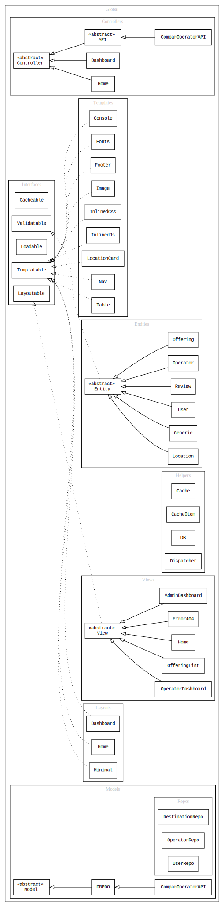

# comparoperator

## installation

1. Clone this repository

    ```shell
    git clone --depth=1 https://github.com/pozorfluo/comparoperator.git
    ```

1. Install dependencies

    ```shell
    npm run setup
    ```

    _( note : on windows execute npm i, then manually install composer, execute
    composer install, download phpDocumentor v3.0.0-rc )_
1. Setup the database with :

    ```
    resources/sql/comparoperator.sql
    ```

    ~~_( note : this will bootstrap the database with test data )_~~

1. In index.php, change DEV_FORCE_CONFIG_UPDATE to true
    ```php
    define('DEV_FORCE_CONFIG_UPDATE', true);
    ```
1. Navigate to index.php in your environment
    - A .env file is created with a skeleton config for this app.
    - Update the default db configuration in .env to match your environment.
      e.g.,
    ```json
      "db_configs": {
        "comparoperator": {
        "DB_DRIVER": "mysql",
        "DB_HOST": "127.0.0.1",
        "DB_PORT": "3306",
        "DB_CHARSET": "utf8mb4",
        "DB_NAME": "tp_comparoperator",
        "DB_USER": "your_user_name",
        "DB_PASSWORD": "your_db_password"
        }
    ```
1. Navigate to index.php

## build

1. Build sass and js

    ```shell
    npm run build
    ```

1. Start build in watch mode

    ```shell
    npm run watch
    ```

1. Stop build in watch mode

    ```shell
    npm run watch-stop
    ```

1. Generate php documentation

    ```shell
    npm run doc-php
    ```

## tests
1. Run php tests

    ```shell
    npm run test-php
    ```

1. Run js tests

    ```shell
    npm run test-js
    ```

1. Run all tests

    ```shell
    npm test
    ```

## [docs](https://pozorfluo.github.io/comparoperator/)

## app flowchart


## db


## class diagram


## wireframes

### desktop/laptop


### tablet
### mobile


## todo
see [project board](https://trello.com/b/zBuG36CV/comparoperator)

## decisions log

-   Follow PSR-1 and PSR-12 coding standards.
-   Use trello project board.
-   Express user requirements using Gherkin syntax.

## reference links
